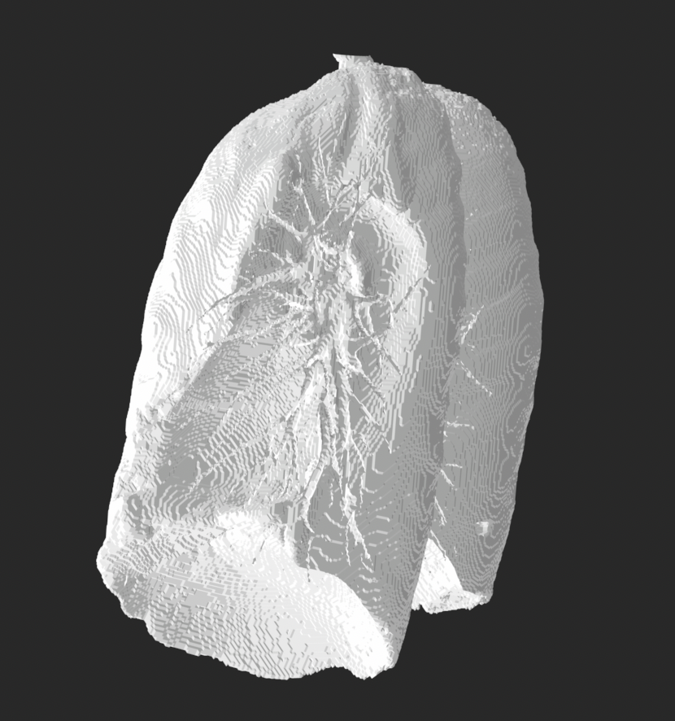

# TopoHealth: A Lung Cancer Diagnostic AI

For my undergraduate capstone project, I created an AI to diagnose lung cancer in CT 
scans. This experimented with a number of techniques from computational geometry and 
topology, both for mesh manipulation and in constructing the actual models. 

The project ended 
up being more accurate than human radiologists, on average. With 
Joaquin Monterrosa and Nic Dzomba, I then hosted these models in an intuitive web application.

    

In the end, our project won a number of awards. These included
the "Best Pitch" and "Biggest Idea" in the MSU "Big Idea Challenge" each for
$500,
as well as the "Best Capstone Award" from the MSU School of Computing for $1000.
I hope to continue this project and 
related work in the future, both during my graduate studies and in a career 
thereafter.

We also presented the application in the MSU undergraduate Research Celebration.
 

If you are interested in a demo of the final product, please contact me. 
(Unfortunately, servers cost money, so the full stack is not always running.) 

If you are interested in the code for the underlying models in the application,
that can be accessed [here](https://github.com/benholmgren/topo-health-models). It is 
currently not maintained, but if you're interested 
in it, let me know!

# Brightvine

I also worked as a software engineer for one year at 
[Brightvine](https://www.brightvine.com/), a startup based in 
Bozeman and San Francisco. In that time, I was the primary creator and maintainer of 
a blockchain network. During my tenure, the network grew to hold roughly
$150 million in financial data. Though most of my work there
was not for public access, I did build a 
[block explorer](https://explorer.brightvine.com/) which is available
for the public to view and inspect activity on the blockchain.
