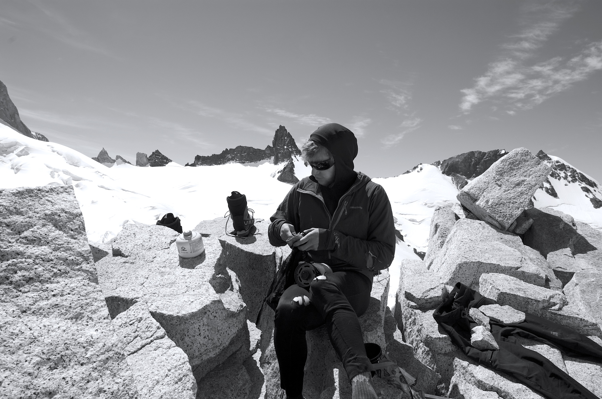
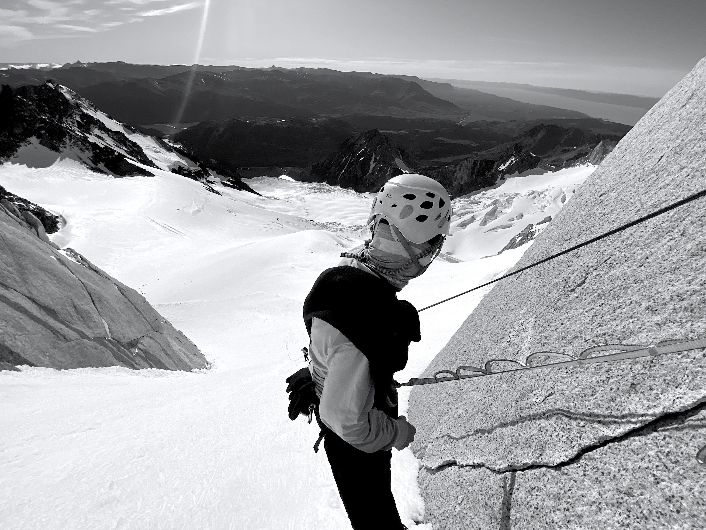
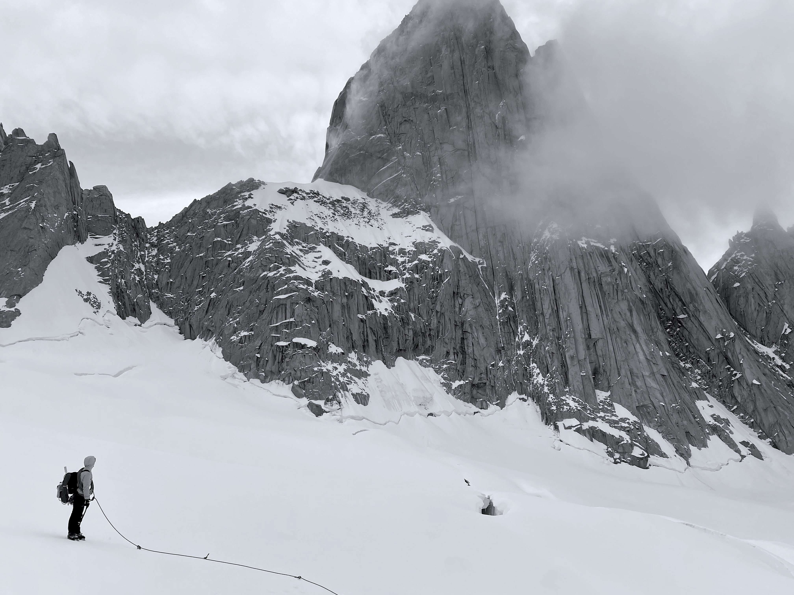

This page contains a bunch of my amateur photos of times in the mountains. 
Someday maybe I'll include more detailed trip reports, but these days I do
enough writing for work. After all, this site is mostly just for me to look back and smile about the good times anyways.

## Alaska

## Patagonia

