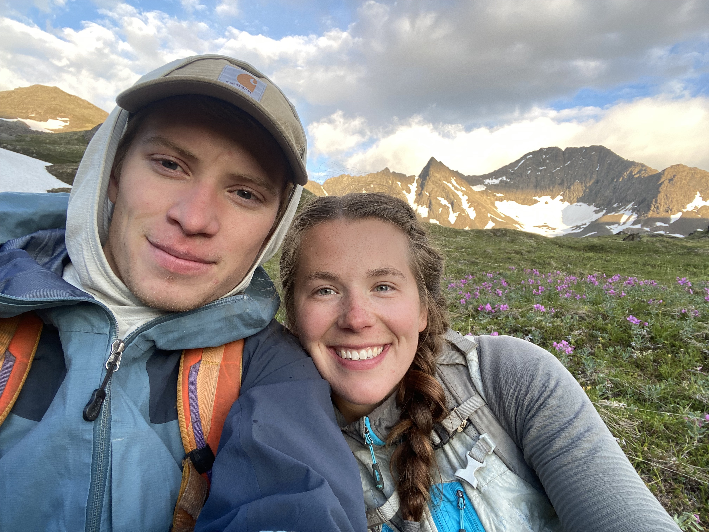
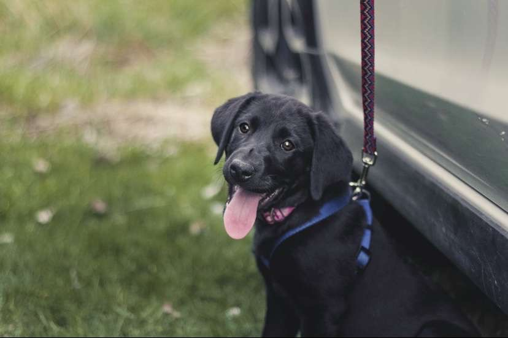

## Me

There are two places that I would so far call home: Montana, where I was raised and 
attended college, and Alaska, where I moved immediately upon graduating. Many facets 
of these two fantastic places are highlighted in my page on mountains. Both have 
enriched my life a great deal.

Far more important than geography, home is defined by people. Here are mine. (And our awesome dog, Rosie. She's a total rascal. Today was the best day of her life.)

## Good Reading

Here are a few pieces of writing that particularly resonated with me (with some recency bias):

* Homo Deus, Yuval Noah Harari
* In Search of the Mount Cleveland Five, Terry Kennedy
* Braiding Sweetgrass, Robin Wall Kimmerer
* But What if We're Wrong?, Chuck Klosterman
* Algorithms, Jeff Erickson
* Patagonia Vertical, Rolando Garibotti
* Just Mercy, Bryan Stevenson
* Jitterbug Perfume, Tom Robbins
* Computational Topology: An Introduction, Herbert Edelsbrunner and John Harer

---

“The struggle itself towards the heights is enough to fill a man's heart. One must imagine Sisyphus happy.” ~ Albert Camus

“Young man, in mathematics you don't understand things. You just get used to them.” 
~ John Von Neumann

"My favorite state has not yet been invented. It will be called Montana, and it will be perfect." ~ Abraham Lincoln

"It doesn't have to be fun to be fun." ~ Mark Twight

