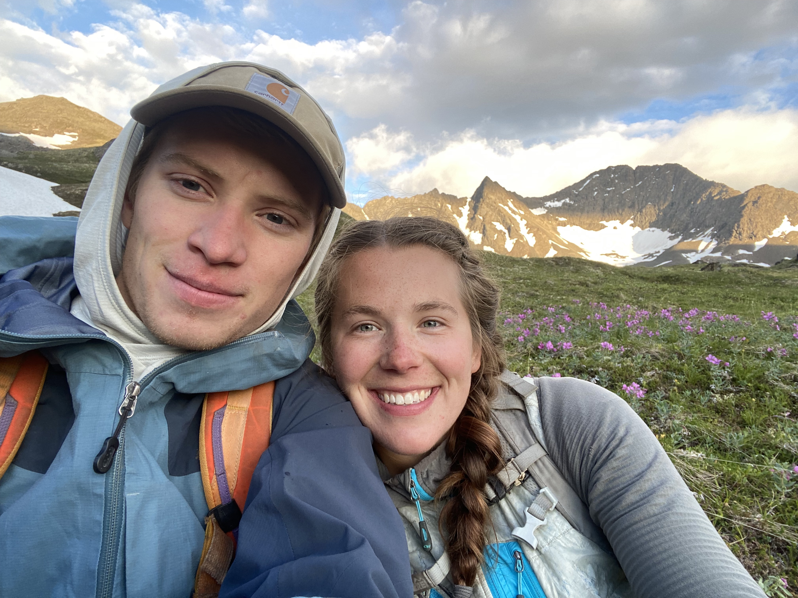
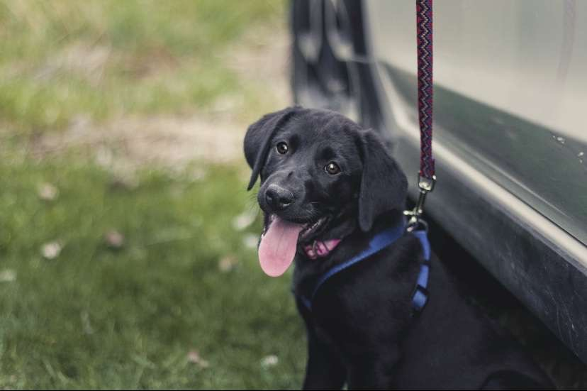

## Me

There are two places that I would so far call home: Montana, where I was raised and 
attended college, and Alaska, where I moved immediately upon graduating with my partner, who is pursuing a 
career in rural medicine. These two fantastic places are highlighted, in small part,
in my page on mountains. 

Though, far more important than geography, we are defined by people. Here are mine. (And our awesome dog, Rosie, when she was a puppy.)

## Good Reading

Here are a few pieces of writing that I am particularly fond of (with some recency bias):

* Homo Deus, Yuval Noah Harari
* In Search of the Mount Cleveland Five, Terry Kennedy
* Braiding Sweetgrass, Robin Wall Kimmerer
* But What if We're Wrong?, Chuck Klosterman
* Using the Borsuk-Ulam Theorem, Jiří Matoušek
* Patagonia Vertical, Rolando Garibotti

---

## Good Quotes

“The struggle itself towards the heights is enough to fill a man's heart. One must imagine Sisyphus happy.” ~ Albert Camus

"Swirling with visions on man's confusion
All of the work, done just to appease him
The Argus he cries, though love has its place in the sun
It's only man's fear that carries him on", ~ Gene and Dean Ween

"My favorite state has not yet been invented. It will be called Montana, and it will be perfect." ~ Abraham Lincoln

"It doesn't have to be fun to be fun." ~ Mark Twight

---

## Random

Erdös Number: 3

